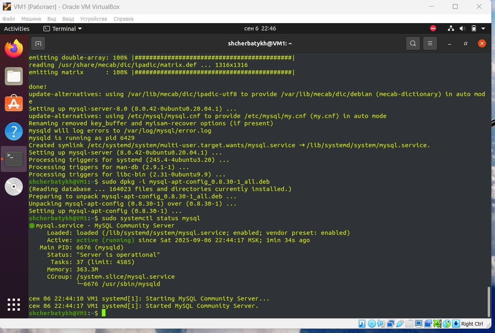
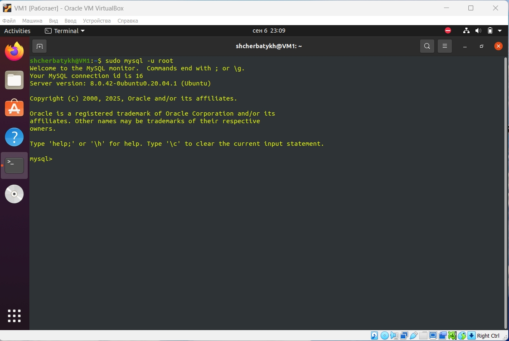
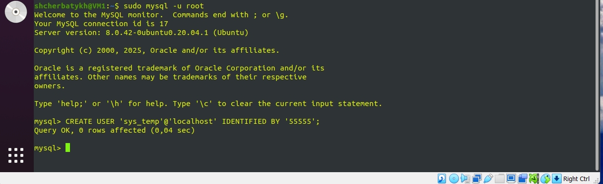
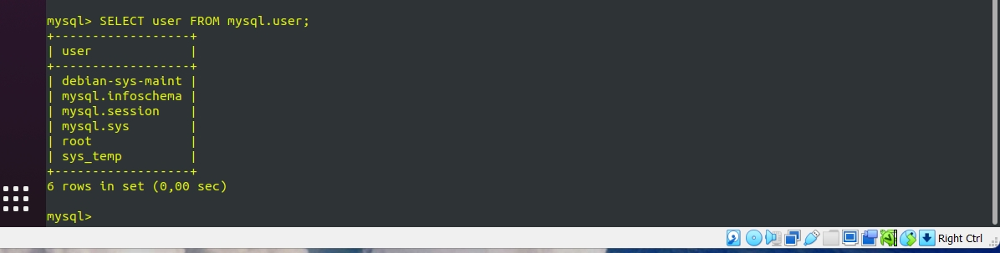
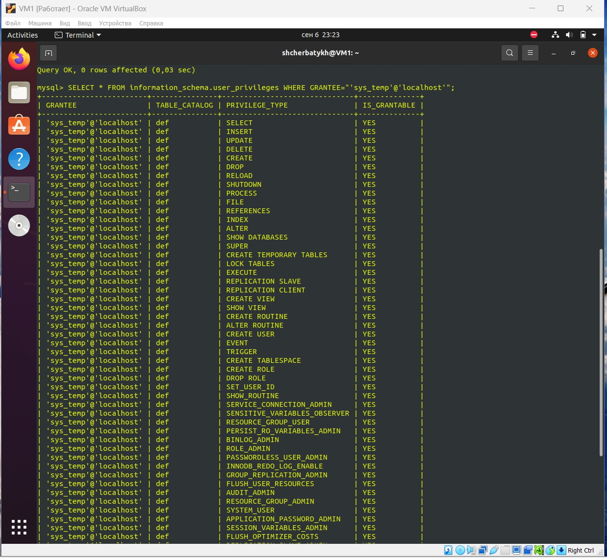
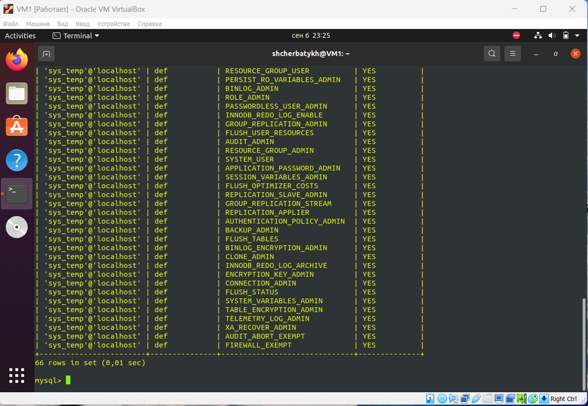

## Домашнее задание к занятию «Работа с данными (DDL/DML)» (Щербатых А.Е.)
### Задание 1.
1.1. Поднимите чистый инстанс MySQL версии 8.0+. Можно использовать локальный сервер или контейнер Docker.
```bash
wget -c https://dev.mysql.com/get/mysql-apt-config_0.8.30-1_all.deb
sudo dpkg -i mysql-apt-config_0.8.30-1_all.deb
sudo apt update
sudo apt install mysql-server
sudo systemctl status mysql
sudo systemctl enable mysql
sudo mysql -u root
```



1.2. Создайте учётную запись sys_temp.
```bash
CREATE USER 'sys_temp'@'localhost' IDENTIFIED BY '55555';
```


1.3. Выполните запрос на получение списка пользователей в базе данных. (скриншот)
```bash
SELECT user FROM mysql.user;
```

1.4. Дайте все права для пользователя sys_temp.
```bash
GRANT ALL PRIVILEGES ON *.* TO 'sys_temp'@'localhost' WITH GRANT OPTION;
```


1.5. Выполните запрос на получение списка прав для пользователя sys_temp. (скриншот)
```bash
SELECT * FROM information_schema.user_privileges WHERE GRANTEE="'sys_temp'@'localhost'";
```


1.6. Переподключитесь к базе данных от имени sys_temp.

Для смены типа аутентификации с sha2 используйте запрос:
```bash
ALTER USER 'sys_test'@'localhost' IDENTIFIED WITH mysql_native_password BY 'password';
```
1.6. По ссылке https://downloads.mysql.com/docs/sakila-db.zip скачайте дамп базы данных.

1.7. Восстановите дамп в базу данных.

1.8. При работе в IDE сформируйте ER-диаграмму получившейся базы данных. При работе в командной строке используйте команду для получения всех таблиц базы данных. (скриншот)

### Задание 2.
Составьте таблицу, используя любой текстовый редактор или Excel, в которой должно быть два столбца: в первом должны быть названия таблиц восстановленной базы, во втором названия первичных ключей этих таблиц. Пример: (скриншот/текст)
```bash
Название таблицы | Название первичного ключа
customer         | customer_id
```
