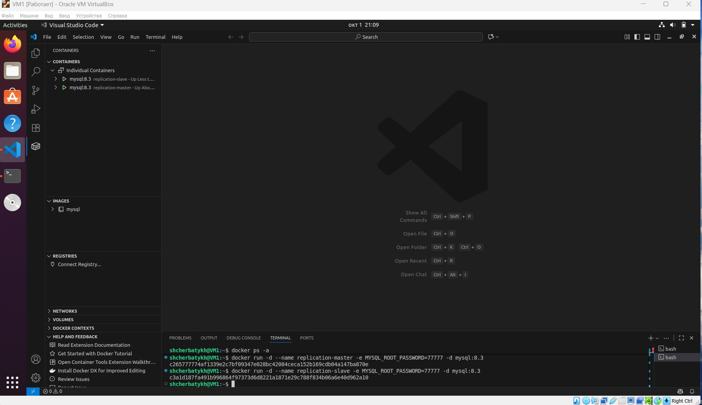
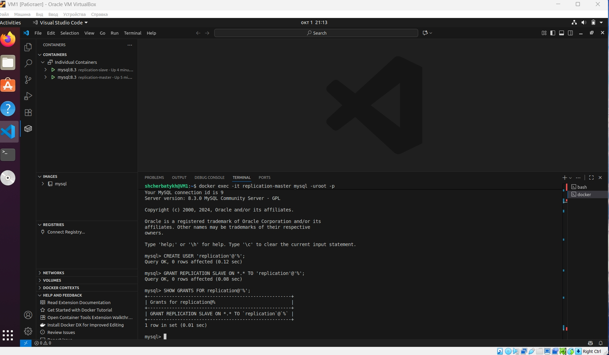
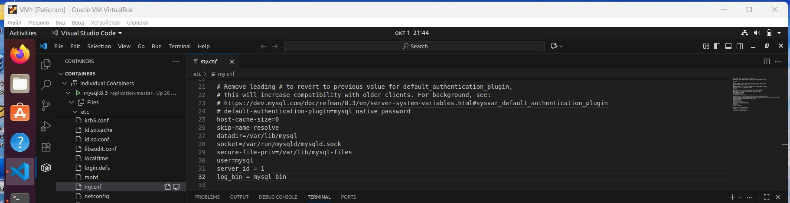
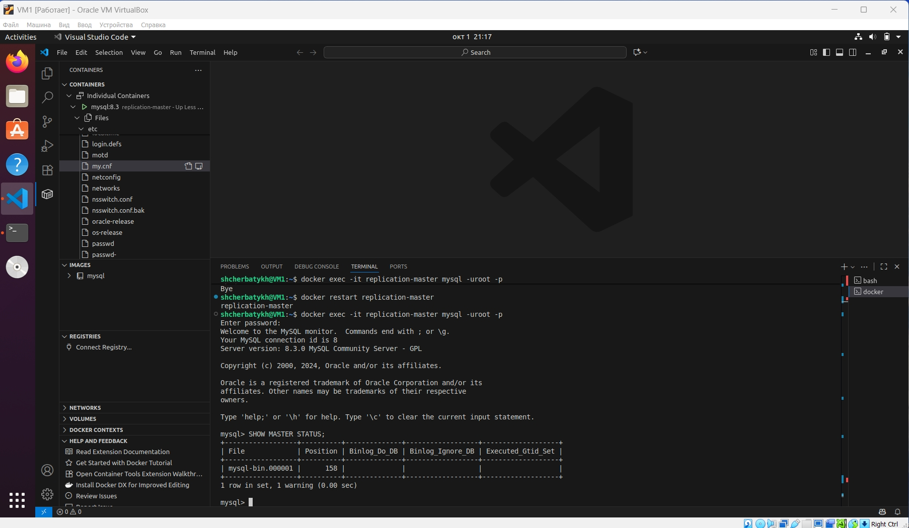
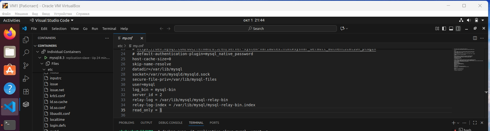
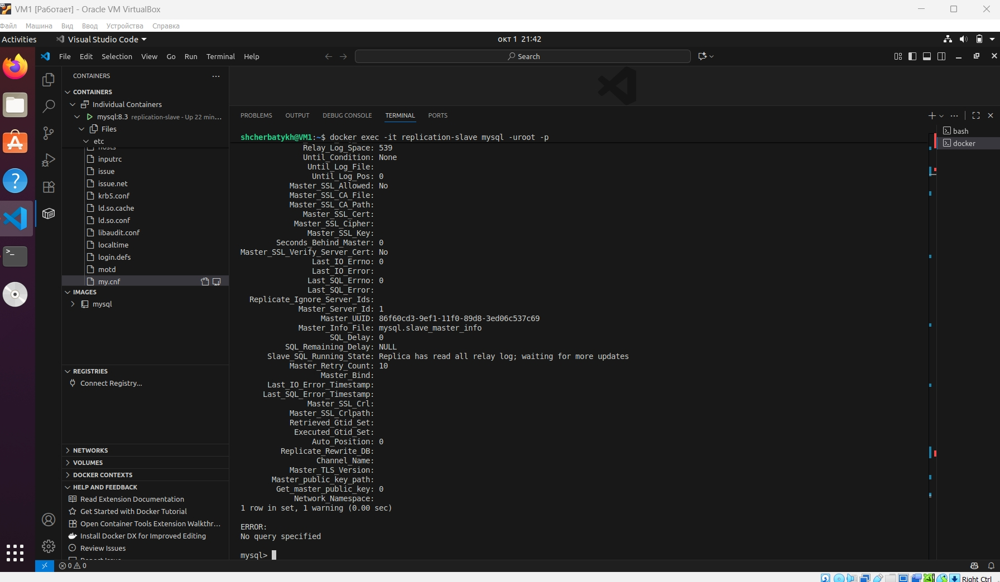
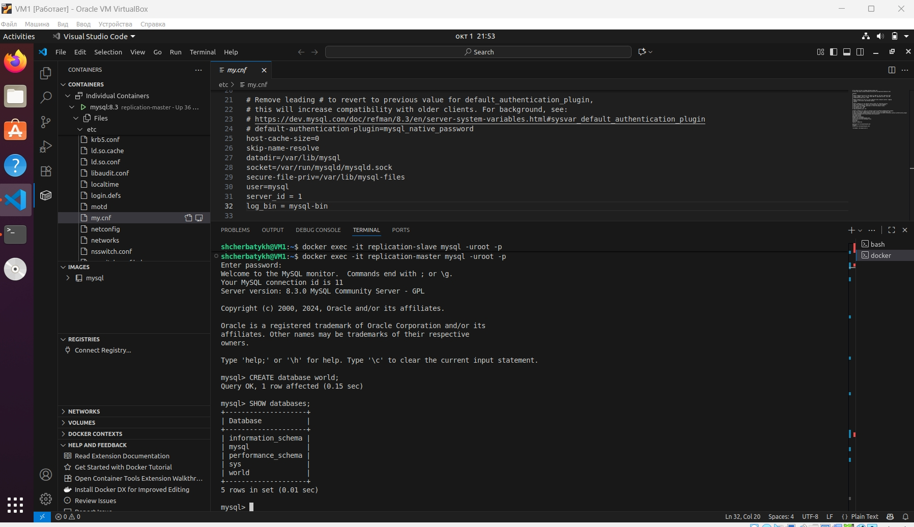
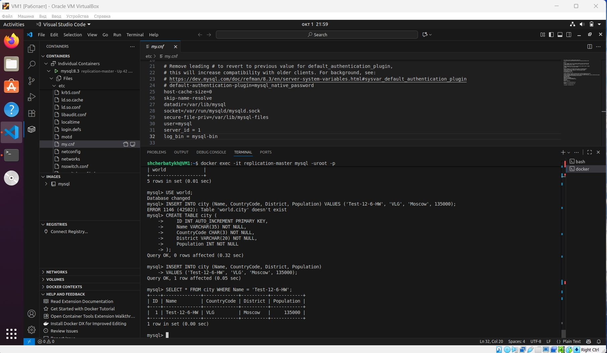
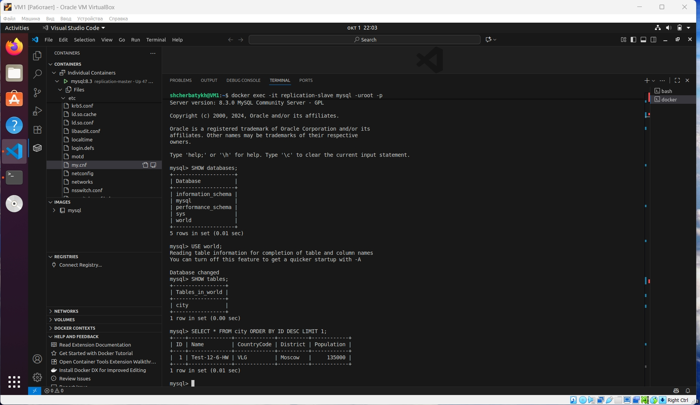

## Домашнее задание к занятию «Репликация и масштабирование. Часть 1» (Щербатых А.Е.)
### Задание 1
На лекции рассматривались режимы репликации master-slave, master-master, опишите их различия.
### Ответ
**Master-Slave репликация**
При реализации такого типа репликации создаётся **один** основной сервер, который называется Master – на нем происходят все изменения (запись) данных. На дублирующем, т.н. slave-сервере, происходит копирование всех изменений, происходящих на Master. Для чтения данных приложение отправляет запросы на Slave, а Master отвечает только за запись и изменения. В этой системе может быть несколько Slave-серверов
Основные характеристики:
- Однонаправленная репликация
- Один Master на запись, несколько Slave на чтение
- Автоматическое переключение при сбое Master

**Репликация Master-Master**
В этой схеме любой сервер может быть использован для изменения и чтения данных, при этом? происходящие на нем изменения будут продублированы на другой сервер. 
Master-Master в режиме active-active: этот вариант известен как двунаправленная репликация. Каждый из двух серверов выступает одновременно и в качестве Master, и в качестве Slave. В этом варианте есть проблема с разрешением конфликтов, когда, например, два запроса начинают одновременно менять одну и ту же строку или когда происходит одновременная автоинкрементная вставка в таблицу на оба сервера.
Основные характеристики:
- Двунаправленная репликация
- Несколько мастеров на запись и чтение
- Конфликт репликации требует разрешения

Основное отличие между режимами заключается в том, что в режиме master-slave, slave могут только принимать запросы на чтение, в то время как master может производить операции записи и операции чтения. В master-master каждый master может производить операции записи и чтения. Master-master имеет больше пропускной способности, но также как и master-slave не поддерживает транзакции, сравнимо медленнее master-slave и менее отказоустойчив.

### Задание 2
Выполните конфигурацию master-slave репликации, примером можно пользоваться из лекции.

*Приложите скриншоты конфигурации, выполнения работы: состояния и режимы работы серверов.*

### Ответ
Установка **master** и **slave**:

Создадим контейнер с именем replication-master и зададим пароль root пользователя.

``` bash
docker run -d --name replication-master -e MYSQL_ROOT_PASSWORD=77777 -d mysql:8.3
```
Создадим контейнер с именем replication-slave и зададим пароль root пользователя

``` bash
docker run -d --name replication-slave -e MYSQL_ROOT_PASSWORD=77777 -d mysql:8.3
```


Создадим учетную запись master для сервера репликации:
``` bash
docker exec -it replication-master mysql -uroot -p
```

В контейнере выполним

``` bash
mysql> CREATE USER 'replication'@'%';
mysql> GRANT REPLICATION SLAVE ON *.* TO 'replication'@'%';
```

Проверим права пользователя
``` bash
SHOW GRANTS FOR replication@'%';
```



Вносим изменения в конфигурацию на master (папка etc) в файл my.cnf-> секция [mysqld] и добавляем следующие параметры:

``` bash
server_id = 1
log_bin = mysql-bin
```


После изменения конфигурации сервера потребуется перезагрузка. После перезагрузки заходим в контейнер и проверяем состояние:

``` bash
docker restart replication-master

docker exec -it replication-master mysql -uroot -p
mysql> SHOW MASTER STATUS;
```


После этого вносим изменения на slave  в конфигурационный файл my.cnf-> секция [mysqld] и добавляем следующие параметры:

``` bash
log_bin = mysql-bin
server_id = 2
relay-log = /var/lib/mysql/mysql-relay-bin
relay-log-index = /var/lib/mysql/mysql-relay-bin.index
read_only = 1
```


После этого обязательно перезагружаем slave
``` bash
docker restart replication-slave
```

Следующим шагом требуется прописать в базе данных на сервере slave, кто является master и данные *File* и *Position*, полученные а результате выполнения команды **SHOW MASTER STATUS;** на сервере master
``` bash
docker exec -it replication-slave mysql -uroot -p
mysql> CHANGE MASTER TO
MASTER_HOST='replication-master',
MASTER_USER='replication',
MASTER_LOG_FILE='mysql-bin.000001',
MASTER_LOG_POS=158;
```

Далее запускаем журнал ретрансляции и проверим статус
``` bash
mysql> START REPLICA;
mysql> SHOW SLAVE STATUS\G;
```



Тестирование работы репликации master - slave

Меняем данные на  сервере master

``` bash
docker exec -it replication-master mysql -uroot -p
mysql> CREATE database world;
mysql> SHOW databases;
mysql> USE world;
```


Создаём таблицу **city** и выполняем **INSERT**
``` bash
mysql> CREATE TABLE city (
       ID INT AUTO_INCREMENT PRIMARY KEY,
       Name VARCHAR(35) NOT NULL,
       CountryCode CHAR(3) NOT NULL,
       District VARCHAR(20) NOT NULL,
       Population INT NOT NULL
);
mysql> INSERT INTO city (Name, CountryCode, District, Population)  VALUES ('Test-12-6-HW', 'VLG', 'Moscow', 135000);
```



Проверяем на сервере slave

``` bash
docker exec -it replication-slave mysql -uroot -p
mysql> SHOW databases;
mysql> USE world;
mysql> SHOW databases;
mysql> SHOW tables;
mysql> SELECT * FROM city ORDER BY ID DESC LIMIT 1;
```


